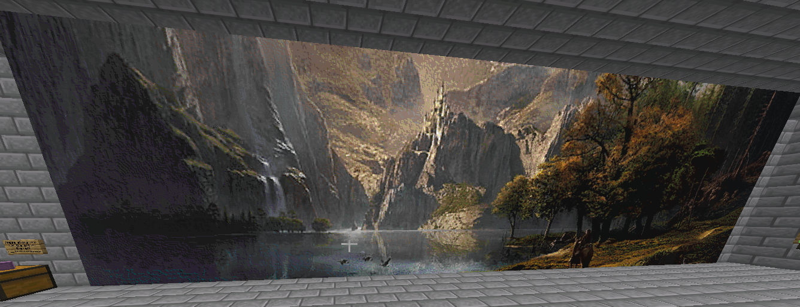
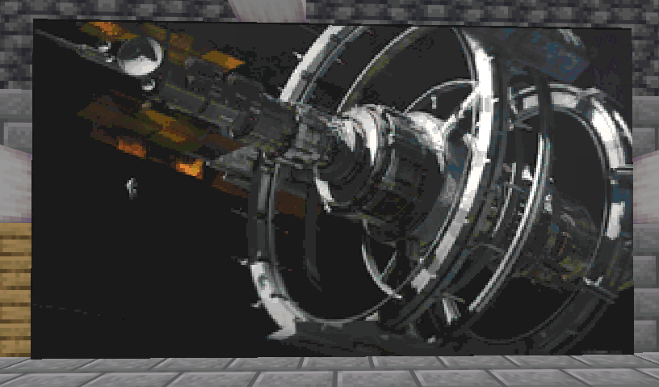
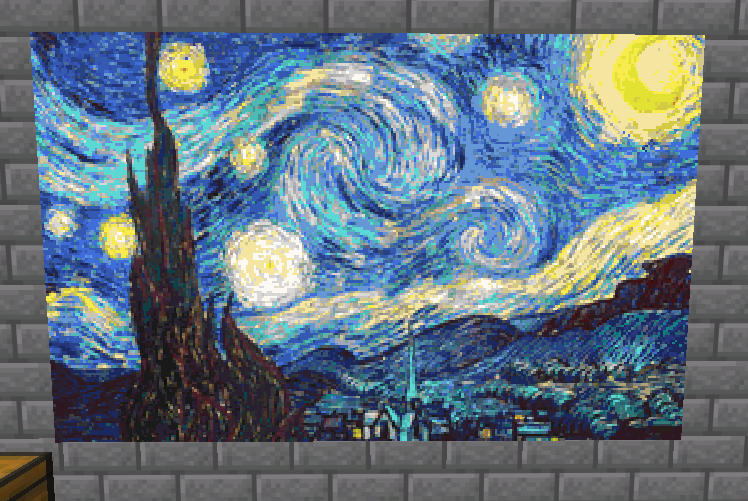
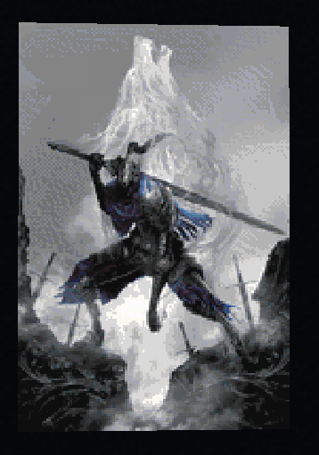

# Painter

Painter is a fabric mod that can be used to 'paint' in game using the [ArtMap](https://gitlab.com/BlockStack/ArtMap) plugin. It relies on reading pre-generated dye placements to know what dye is supposed to go where. These dye placements can be generated using the associated [Painter Image Processor](https://github.com/Gank-Squad/fabric-painter-image-processor)

## Usage

To get started, open a pre-generated dye placement file. To do this, press "O" by default to open the GUI. Paste the complete path to the folder containing the pre-generated dye placements (e.g. `C:\Users\user\Pictures\artmap`).

Once the path is pasted in, click "Load" and click the +/- buttons next to the "Load" button to change what panel will be painted if the image is larger than 32x32 pixels.

The next step is to set the background colour listed in the GUI. Do this by exiting the GUI and changing the background colour of the canvas. Now you can press "I" to start painting. Pressing "I" again will pause, and pressing "Load" in the GUI will reset it.

After you finish painting with all the dyes in your inventory, replace any dyes you missed on the first pass and start painting again.

## Examples
All images are screenshots taken from in game, of paintings made using this mod.

[Idyll's Fall](https://steamcommunity.com/sharedfiles/filedetails/?id=1096335905#:~:text=Steam%20Workshop::Idyll%27s%20Fall%20%5B2560x1600%5D.)

[Space Station](https://www.artstation.com/artwork/k46zLy)

The Starry Night by Vincent van Gogh

[Artorias of the Abyss](https://nekro.artstation.com/projects/3ok44E)